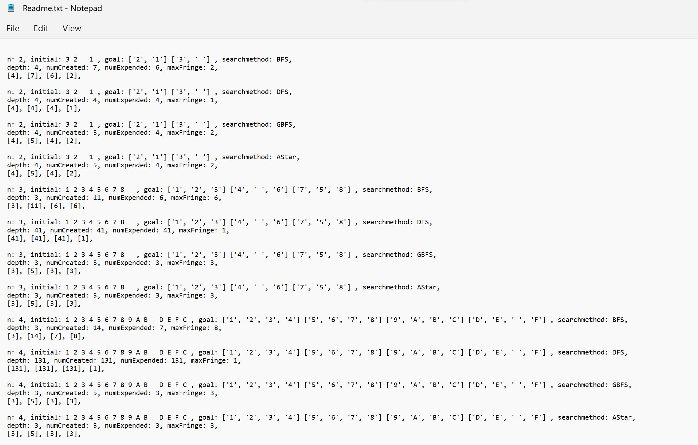

# Sliding-Puzzle

Sliding Puzzle (class homework) - 
For a given puzzle of n x n squares with numbers from 1 to (n x n-1) (one square is empty) in an initial configuration, finds a sequence of movements for the numbers in order to reach a final given configuration.
A number can move (horizontally or vertically) on an adjacent empty square.
The puzzle for size n = 2 (2 x 2 squares), 3 (3 x 3 squares), 4 (4 x 4 squares), 5(5 x 5), or combination of the sizes listed ahead.
The program checks if puzzle is solvable or not and outputs the result using BFS, DFS, GBFS, A* algorithms.  
Technologies used: Python

